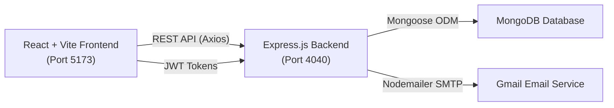
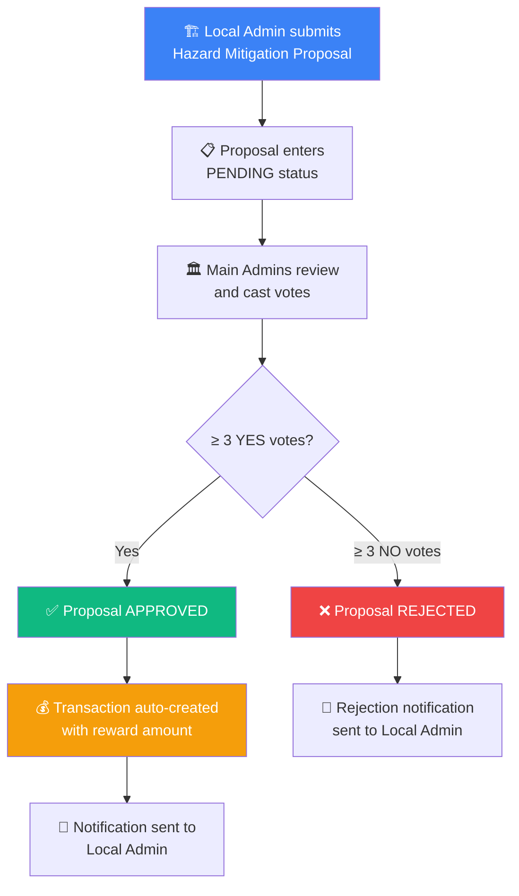
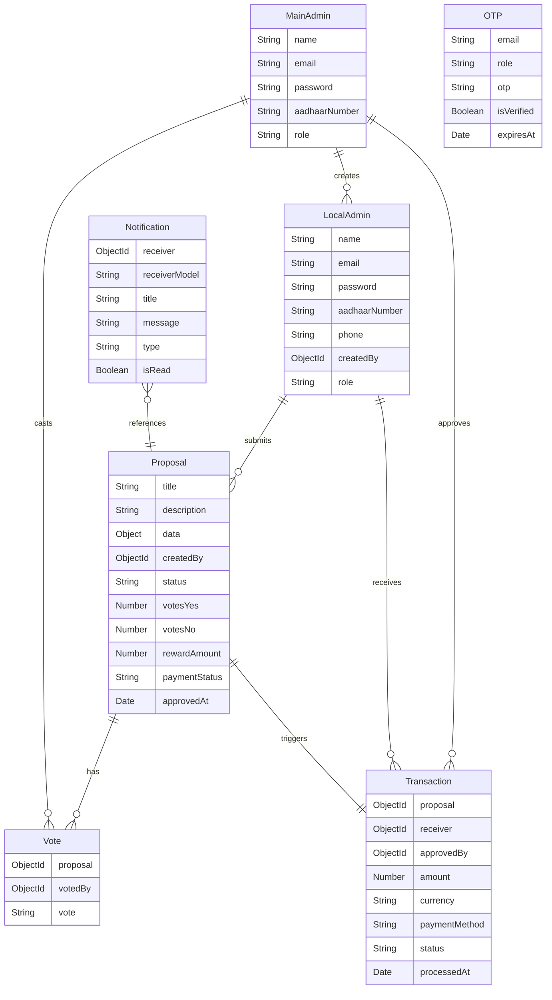

# 🛡️ HazardShield — Hazard Mitigation & Recovery Platform

## Project Overview

**HazardShield** is a full-stack, role-based web application designed to streamline the **end-to-end lifecycle of disaster hazard mitigation and recovery proposals** — from submission and democratic voting through to financial disbursement and real-time notifications. Built as a decentralized governance tool, it empowers **Local Administrators** to submit recovery proposals for their regions while enabling a panel of **Main Administrators** to transparently evaluate, vote on, and fund those proposals through a structured majority-rule system.

The platform digitizes and secures what is traditionally a slow, opaque, paper-heavy bureaucratic process — transforming hazard relief fund allocation into a transparent, auditable, and efficient digital workflow.

---

## Problem Statement

In the aftermath of natural disasters — floods, earthquakes, cyclones — local government bodies often struggle with:

- **Slow, manual proposal submission** for relief and mitigation funding
- **Opaque decision-making** with no clear audit trail on approvals or rejections
- **Lack of accountability** in fund disbursement and payment tracking
- **No real-time communication** between field-level administrators and central authorities

HazardShield directly addresses these pain points by providing a **centralized digital platform** where proposals flow transparently from creation → voting → approval → payment, with every step logged, notified, and auditable.

---

## Architecture

The project follows a clean **client-server architecture** with a decoupled frontend and backend:



| Layer       | Technology                 | Purpose                                      |
|-------------|----------------------------|----------------------------------------------|
| **Frontend**| React 19 + Vite 8          | SPA with role-aware routing & glassmorphism UI |
| **Backend** | Node.js + Express 5        | RESTful API server with middleware pipeline    |
| **Database**| MongoDB + Mongoose 9       | NoSQL document storage with schema validation  |
| **Auth**    | JWT + bcryptjs             | Stateless token-based authentication           |
| **Email**   | Nodemailer                 | OTP delivery for password recovery             |
| **Security**| Helmet + CORS + Role Guards| HTTP header hardening and access control        |

---

## Technology Stack

### Backend
| Package        | Version | Role                                             |
|----------------|---------|--------------------------------------------------|
| `express`      | 5.2.1   | Web framework for RESTful API routing             |
| `mongoose`     | 9.3.3   | MongoDB object modeling with schema validation    |
| `jsonwebtoken` | 9.0.3   | JWT generation and verification                   |
| `bcryptjs`     | 3.0.3   | Password hashing with salt rounds                 |
| `helmet`       | 8.1.0   | Security headers (XSS, MIME sniffing, etc.)       |
| `cors`         | 2.8.6   | Cross-Origin Resource Sharing configuration       |
| `morgan`       | 1.10.1  | HTTP request logging in development mode          |
| `nodemailer`   | 8.0.4   | SMTP email delivery for OTP-based password reset  |
| `dotenv`       | 17.3.1  | Environment variable management                   |
| `nodemon`      | 3.1.14  | Hot-reload development server                     |

### Frontend
| Package            | Version | Role                                            |
|--------------------|---------|--------------------------------------------------|
| `react`            | 19.2.4  | UI component library                              |
| `react-dom`        | 19.2.4  | DOM rendering                                     |
| `react-router-dom` | 7.14.0  | Client-side routing with protected route guards   |
| `axios`            | 1.15.0  | HTTP client for API communication                 |
| `lucide-react`     | 1.8.0   | Modern icon library (SVG-based)                   |
| `react-hot-toast`  | 2.6.0   | Toast notification system                         |
| `vite`             | 8.0.4   | Lightning-fast build tool and dev server          |

---

## User Roles & Features

### 🏛 Main Admin (Central Authority)

The Main Admin represents the central governing authority responsible for overseeing, evaluating, and approving hazard mitigation proposals.

| Feature               | Description                                                                                           |
|-----------------------|-------------------------------------------------------------------------------------------------------|
| **Dashboard**         | Overview of system-wide statistics — total proposals, approval rates, pending reviews, fund outflow     |
| **Manage Local Admins** | Register new Local Admin accounts with Aadhaar verification, view all registered field administrators  |
| **Review All Proposals** | Browse and inspect every proposal submitted across all regions, with full voting status visibility    |
| **Cast Votes**        | Vote **YES** or **NO** on pending proposals; once **3 YES votes** are reached, the proposal is auto-approved |
| **Transaction Ledger** | View all financial transactions — amounts disbursed, payment methods, bank references, statuses       |
| **Notifications**     | Receive real-time alerts on new proposals, vote updates, and system events                             |

### 📍 Local Admin (Field-Level Administrator)

The Local Admin represents on-the-ground administrators in disaster-affected regions who submit proposals for relief funding.

| Feature               | Description                                                                                           |
|-----------------------|-------------------------------------------------------------------------------------------------------|
| **Dashboard**         | Personal overview — submitted proposals, approval status, payment history                               |
| **Submit New Proposal** | Create a hazard mitigation proposal with title, description, custom data fields, and requested reward amount |
| **My Proposals**      | Track all submitted proposals with real-time status updates (Pending → Approved/Rejected)               |
| **My Payments**       | View transaction history — payment amounts, statuses, processing dates, bank references                 |
| **Profile**           | View and manage personal profile information (name, email, Aadhaar, phone)                              |
| **Notifications**     | Receive alerts when proposals are approved/rejected and payments are sent                                |

---

## Core Workflow



1. **Proposal Submission** — A Local Admin creates a detailed proposal specifying the hazard, required mitigation work, and the funding amount needed.
2. **Democratic Voting** — Multiple Main Admins independently review the proposal and cast their vote (YES or NO). This ensures no single authority can unilaterally approve or reject funding.
3. **Majority-Rule Approval** — Once a proposal accumulates **3 or more YES votes**, it is automatically marked as **APPROVED**. Similarly, **3 or more NO votes** triggers automatic **REJECTION**.
4. **Automatic Fund Disbursement** — Upon approval, the system automatically creates a financial transaction record linked to the proposal, logging the reward amount, receiver, approver, and payment status.
5. **Real-Time Notifications** — The Local Admin is instantly notified of the outcome (approval or rejection) via the in-app notification system.

---

## Database Schema Design

The application uses **7 Mongoose models** with well-defined relationships:



---

## API Architecture

The backend exposes **7 RESTful route groups** under the `/api` prefix:

| Route Prefix           | Auth Required  | Description                                                   |
|------------------------|---------------|---------------------------------------------------------------|
| `/api/main-admin`      | Main Admin    | Register Main Admins, manage Local Admin accounts              |
| `/api/local-admin`     | Local Admin   | Login, profile management for field administrators             |
| `/api/auth`            | Public        | Password reset flow — Forgot Password → Verify OTP → Reset    |
| `/api/proposals`       | Authenticated | Create, list, and inspect mitigation proposals                 |
| `/api/votes`           | Main Admin    | Cast votes on proposals, view voting results                   |
| `/api/transactions`    | Authenticated | View and track financial disbursements                         |
| `/api/notifications`   | Authenticated | List, read, and manage notification alerts                     |

### Security Middleware Pipeline

```
Request → Helmet (HTTP headers) → CORS → Morgan (logging) → Body Parser → JWT Auth → Role Guard → Controller → Error Handler
```

- **`protect`** — Verifies JWT token from `Authorization: Bearer <token>` header
- **`protectMainAdmin`** — Verifies token AND ensures `role === "MAIN_ADMIN"`
- **`protectLocalAdmin`** — Verifies token AND ensures `role === "LOCAL_ADMIN"`
- **`notificationOwnership`** — Ensures users can only access their own notifications

---

## Frontend Design & UI

The frontend features a **modern dark-mode UI** with a **glassmorphism aesthetic** — frosted-glass cards, subtle gradients, and smooth micro-animations. Key design elements include:

- **Role-Aware Routing** — The app dynamically renders different navigation, dashboard views, and page sets depending on whether the user is a Main Admin or Local Admin
- **Protected Route Guards** — Three layers of protection: `RequireAuth`, `RequireMainAdmin`, and `RequireLocalAdmin` components wrap routes to enforce access control client-side
- **Responsive Sidebar Navigation** — A collapsible sidebar with section labels, Lucide icons, active-state highlighting, and notification badges
- **Toast Notification System** — Using `react-hot-toast` for real-time feedback on all user actions (login success, proposal submitted, errors, etc.)
- **Custom 404 Page** — A themed "404 — Lost at Sea" page for unmatched routes
- **Persistent Auth State** — Authentication tokens and user data are persisted in `localStorage` and restored via React Context on page reload

---

## Security Measures

| Layer            | Mechanism                                                                         |
|------------------|-----------------------------------------------------------------------------------|
| **Password Storage** | bcryptjs with 10 salt rounds — passwords are never stored in plain text        |
| **Authentication** | JWT tokens with 14-day expiry, transmitted via `Authorization: Bearer` header    |
| **Authorization**  | Role-based middleware guards on every protected endpoint                          |
| **HTTP Security**  | Helmet.js adds 11+ security headers (CSP, X-Frame-Options, HSTS, etc.)          |
| **OTP Recovery**   | Time-limited (5-minute expiry), 4-digit OTP codes sent via authenticated SMTP    |
| **Input Validation**| Aadhaar (12-digit regex), phone (10-digit regex), password (6+ characters)       |
| **Notification Integrity** | Receiver field is immutable after creation; ownership middleware prevents cross-user access |
| **Duplicate Prevention** | Vote deduplication per admin per proposal; unique transaction per proposal     |

---

## Project Folder Structure

```
hackathon/
├── backend/
│   ├── src/
│   │   ├── app.js                          # Express app setup & middleware pipeline
│   │   ├── server.js                       # Server bootstrap & MongoDB connection
│   │   ├── config/
│   │   │   ├── db.js                       # Mongoose connection configuration
│   │   │   └── mail.js                     # Nodemailer SMTP transport setup
│   │   ├── controllers/                    # Business logic (7 controllers)
│   │   ├── models/                         # Mongoose schemas (7 models)
│   │   ├── routes/                         # Express route definitions (7 route files)
│   │   └── middlewares/                    # Auth, role, ownership, & error handlers
│   ├── package.json
│   └── .env                                # Environment variables (secrets)
│
├── frontend/
│   ├── src/
│   │   ├── App.jsx                         # Root component with role-based routing
│   │   ├── main.jsx                        # React entry point with providers
│   │   ├── index.css                       # Global styles (dark mode + glassmorphism)
│   │   ├── api/axios.js                    # Pre-configured Axios instance
│   │   ├── context/AuthContext.jsx          # Authentication state management
│   │   ├── components/                     # Shared layout components (Sidebar, DashboardLayout)
│   │   └── pages/
│   │       ├── auth/                       # Login & Forgot Password pages
│   │       ├── mainAdmin/                  # Dashboard, Local Admins, Proposals, Transactions
│   │       ├── localAdmin/                 # Dashboard, My Proposals, New Proposal, Payments, Profile
│   │       └── shared/                     # Notifications (shared between both roles)
│   ├── package.json
│   └── vite.config.js
│
├── README.md
└── .gitignore
```

---

## Getting Started

### Prerequisites

- **Node.js** (v18 or higher)
- **MongoDB** (local instance or MongoDB Atlas cloud)
- **Gmail account** with App Password enabled (for OTP emails)

### Environment Variables

Create a `.env` file in the `backend/` directory:

```env
PORT=4040
MONGO_URI=your_mongo_connection_string
JWT_SECRET=your_jwt_secret
EMAIL_USER=your_email@gmail.com
EMAIL_PASS=your_email_app_password
```

### Backend Setup

```bash
cd backend
npm install
npm run dev      # Starts on http://localhost:4040
```

### Frontend Setup

```bash
cd frontend
npm install
npm run dev      # Starts on http://localhost:5173
```

### API Base URL

```
http://localhost:4040/api
```

---

## Important Notes

- The frontend uses Axios to call the backend at `http://localhost:4040/api`
- OTP emails require valid Gmail credentials configured in `backend/.env`
- If using Gmail with 2FA, generate an **App Password** and use that in `EMAIL_PASS`
- The backend uses MongoDB via the connection URI in `MONGO_URI`

---

## License

This project is licensed under the **ISC License**.

---

<p align="center">
  <b>Tech Stack:</b> React 19 · Vite 8 · Node.js · Express 5 · MongoDB · Mongoose 9 · JWT · bcryptjs · Helmet · Nodemailer · Axios · React Router 7 · Lucide Icons · React Hot Toast
</p>

<p align="center">
  <b>Key Differentiators:</b> Democratic voting system (3-vote majority rule) · Automatic transaction creation on approval · OTP-based password recovery · Role-aware UI with protected routing · Glassmorphism dark-mode design · Full notification lifecycle management
</p>
